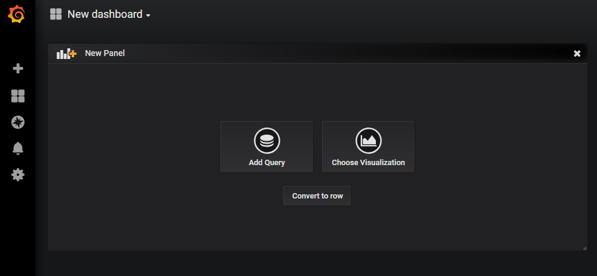

# Grafana

## 1. 什麼是 Grafana?

是一個適合拿來做資源監測 GUI 介面，可以圖形化各種監測服務，如 Prometheus、Elasticsearch、Postgres 等。


## 2. 安裝

1. 到官方網站的[下載頁面](https://grafana.com/grafana/download)，選擇自己使用的作業系統進行下載。

    

1. 解壓縮檔案。
1. 執行解壓縮目錄下的檔案 `bin/grafana-server.exe`。

    

1. 啟動完成後，拜訪路徑 [localhost:3000](localhost:3000)。
1. 輸入帳號密碼登入，帳號和密碼預設均為 `admin`。

    

1. 成功登入後會出現更換密碼的提示，可以按 skip (略過) 維持預設。

    

1. 進到首頁畫面成功完成。

    

## 3. Data Source with Prometheus

* 先啟動 Prometheus。(可以參考 Prometheus 教學)
* 在左欄中找到 Configuration，點選 Data Sources，並點選 Add data source 如下圖所示。

    

* 選擇 Prometheus。

    

* 設定 Prometheus 相關參數，這邊命名為 test，並使用剛才預設啟動 Prometheus 的 9090 port 來串接。設定完成後按下 Save & Test 。

    

* 重新回到 Configuration，這時候可以看到已經出現剛才設定的 test。

    

## 4. Dashboard

* 接下來將會實際測試並把資訊顯示在 panel 上，請先啟動檔案路徑 `monitoring-system/prometheus/prometheus/` 目錄下的 spring-boot-example 專案。
* 選擇左邊的 Create Dashboard，這時候畫面會帶到下面圖示，請選擇 Choose Visualization。一個 Dashboard 上面有許多的 Panel (看板)，這邊就是在新增看板並決定要觀察並顯示的資訊。

    

* 進去後會有非常多種圖表可供選擇，但當前版本只有 Graph 支援告警系統(可發送警告提示)，這邊先示範 Graph 使用方法。請選擇 Graph 後，不改變其他設定。

    

* 調整左欄到最上面的 Queries，請在 Queries to 選擇剛才接好的 test。接下來可以在 `A` 中設定想要觀察的資料，這裡要觀察 response 狀態 500 的次數，完成後請按右上角儲存。
    ```
    http_server_requests_seconds_count{status="500"}
    ```
    

* 完成後請按右上角儲存，並自行命名 Dashboard，筆者命名為 spring-boot-fail。
* 接下來左欄選擇 Dashboard -> Manage，就可以看剛才新增的 Dashboard。

    <br>
    <br>
    

* 嘗試呼叫錯誤的 API，路徑為 [localhost:8080/fail](localhost:8080/fail)，可以看到圖形即時的變化。

    
    
## 5. Alert

