# Prometheus

## 1. 什麼是 prometheus?

是一個適合拿來做資源監測的服務，例如 CPU，記憶體等使用狀況，並在出現狀況時透過警告系統即時通報。


在官方的文件中，建議盡量由 Prometheus server(以下簡稱 server) 使用 pull 的方式獲取資料，但部分服務無法持續和 server 連線，而是在事件發生後即不可獲取，例如排程(執行完成後 server 就無法拜訪)，這時候需要將要監測的資料 push 到 Pushgateway，再由 server 用 pull 的方式獲取。<br>
<br>
不推薦的原因為 Pushgateway 並不會主動清除資料，需要使用者自行清除，且 Pushgateway 並沒有持續優化，建議還是盡量使用 pull 的方式。<br>
<br>
警示系統的部分可以使用 Alertmanager，也可以透過 Grafana 介面來告警。另外 Grafana 也可以更好地呈現資訊，所以一般是透過 Grafana 提供的 GUI 介面來觀察並提供警示。

## 2. 安裝

1. 到[官方網站](https://prometheus.io/download/)下載點，將作業系統調為您本機的作業系統，選擇架構，筆者這邊是使用 Windows amd64，之後下載檔案。

    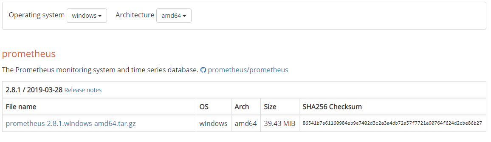

1. 解壓縮。
1. 啟動 `prometheus.exe`。
1. 拜訪路徑 [http://localhost:9090](http://localhost:9090)。

    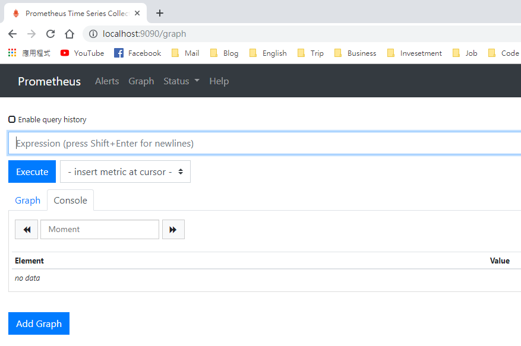

1. 在 Status 下選擇 Targets，可以看到以下畫面，代表 Prometheus 正在監控自己。

    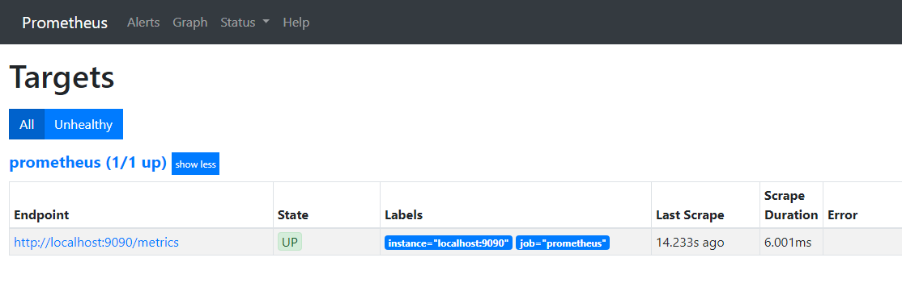

1. 點一下藍字的 [http://localhost:9090/metrics](http://localhost:9090/metrics)，可以看到下列畫面，這是每隔一段時間，Prometheus 所獲得(pull)的資料，然後使用者再根據這些原始資料做監控。

    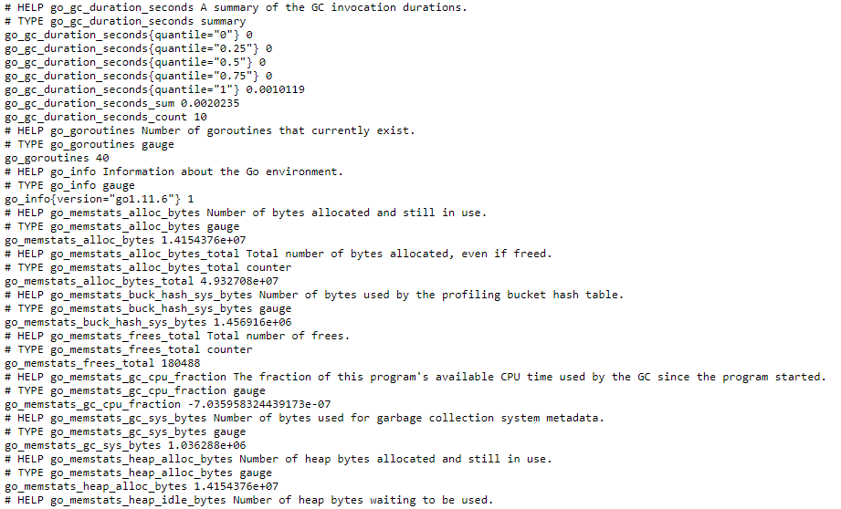

## 3. Spring Boot with Prometheus

* 先到 [Spring Initializr](https://start.spring.io/) 製作一個 Spring Boot 專案並下載壓縮檔，請記得加入 web dependency。

    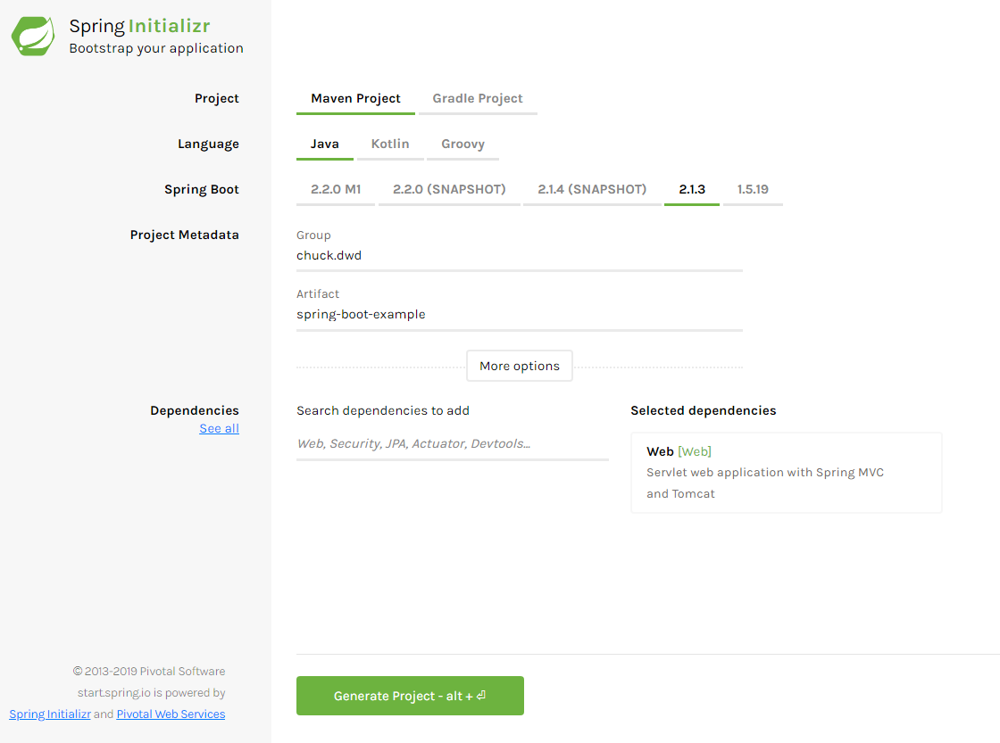

* Import 專案到 Eclipse 中。
* 新增 dependency 到 `pom.xml` 中(如果您是使用 Spring 1.5 以下的版本需要使用 simpleclient 和 simpleclient_spring_boot 的 dependency)：
    ```xml
    <!-- Spring boot actuator to expose metrics endpoint -->
    <dependency>
        <groupId>org.springframework.boot</groupId>
        <artifactId>spring-boot-starter-actuator</artifactId>
    </dependency> 
    
    <!-- Micormeter core dependecy -->
    <dependency>
        <groupId>io.micrometer</groupId>
        <artifactId>micrometer-core</artifactId>
    </dependency> 
    
    <!-- Micrometer Prometheus registry -->
    <dependency>
        <groupId>io.micrometer</groupId>
        <artifactId>micrometer-registry-prometheus</artifactId>
    </dependency>
    ```
* 新增一個 Controller 類別，其中 fail() 故意設計成失敗(1/0 會報錯)，來測試監控機制。程式碼如下：
    ```java
    import org.springframework.web.bind.annotation.RequestMapping;
    import org.springframework.web.bind.annotation.RestController;

    @RestController
    public class Controller {

      @RequestMapping("/index")
      public String index() {
        return "Hello World!";
      }

      @RequestMapping("/fail")
      public String fail() {
        int a = 1 / 0;
        return "Hello World!";
      }
    }
    ```
* 修改 application.properties 如下：
    ```properties
    # ENDPOINTS WEB CONFIGURATION
    # Use "*" to expose all endpoints, or a comma-separated list to expose selected ones
    management.endpoints.web.exposure.include=*
    ```
* 啟動 Spring Boot。
* 拜訪 [http://localhost:8080/actuator](http://localhost:8080/actuator) 可以看到監控的內容。

    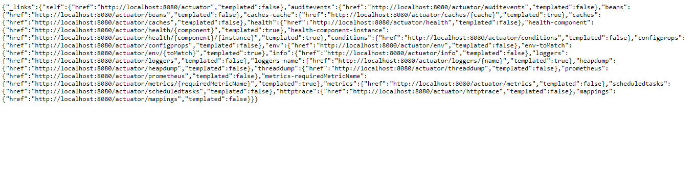

* 拜訪 [http://localhost:8080/actuator/prometheus](http://localhost:8080/actuator/prometheus) 可以看到 Prometheus 監控的內容(截圖僅部分內容)。

    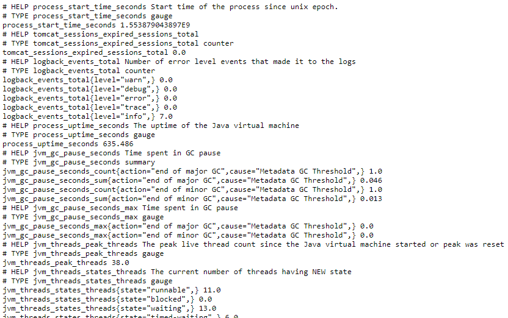

* 接下來要將服務註冊到 Prometheus 上，請打開 `prometheus.yml`，位置如下圖，並增加下列設定。
    ```yml
    ...
    scrape_configs:
      ...

      #for sprint boot
      - job_name: 'spring-boot'
        scrape_interval: 5s
        scrape_timeout: 5s
        metrics_path: /actuator/prometheus
        scheme: http
        static_configs:
        - targets: ['localhost:8080']
    ```
    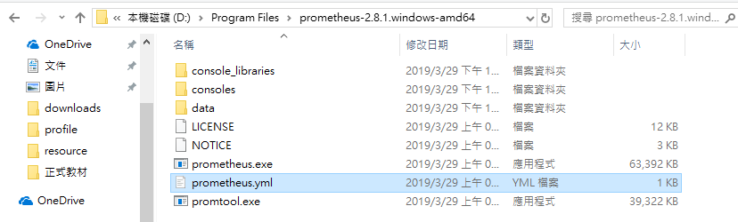

* 關閉 cmd 後重新啟動 `prometheus.exe`。
* 拜訪 [http://localhost:9090/targets](http://localhost:9090/targets)，可以看到剛才的 Spring Boot 服務已經註冊上來，點擊 spring-boot 的 Endpoint 就可以帶到剛才的監控資料。

    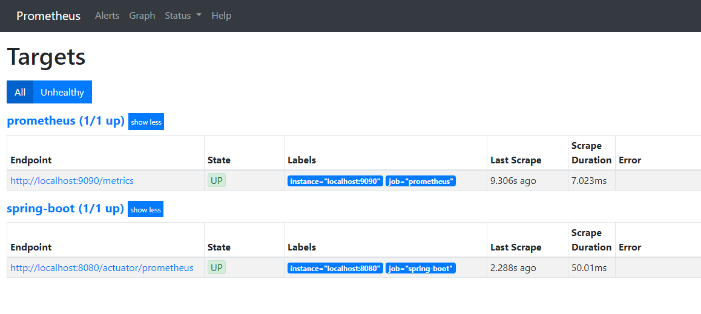<br>
    <br>
    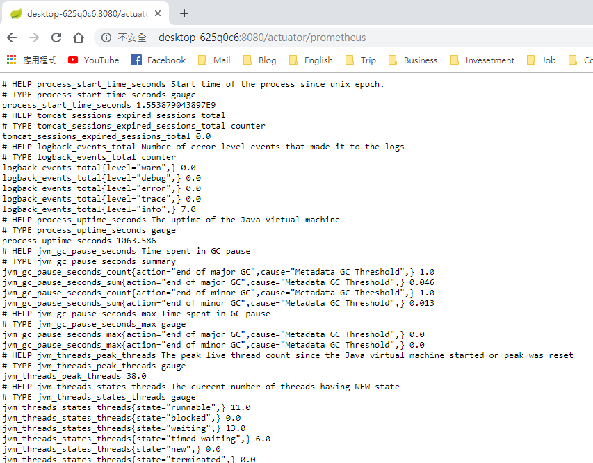

## 4. 測試

* 在本節我們將測試 Prometheus 蒐集的資訊，首先拜訪路徑 [http://localhost:8080/index](http://localhost:8080/index)，可以得到 `Hello World!` 結果如下：

    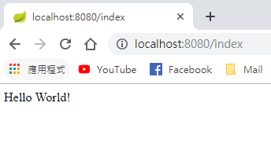

* 取得結果之後，重新拜訪 spring-boot 在 Prometheus 上的端點 [http://localhost:8080/actuator/prometheus](http://localhost:8080/actuator/prometheus)，接著搜尋字串 `index` 如下：

    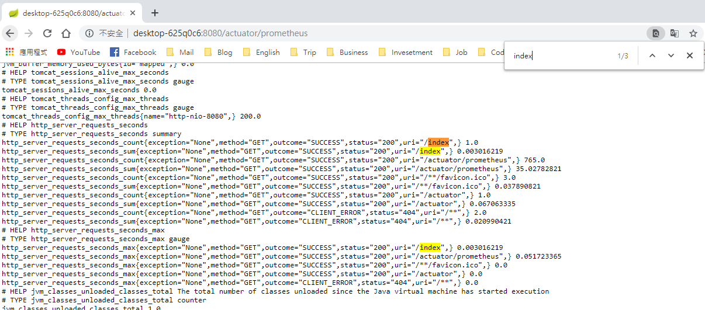

* 可以觀察到剛才的請求花費總時間(`http_server_requests_seconds_sum`)為 0.003016 秒，總次數(`http_server_requests_seconds_count`)為 1.0 次，本次請求最大值(`http_server_requests_seconds_max`)為 0.003016 秒。
    ```
    ...
    http_server_requests_seconds_count{exception="None",method="GET",outcome="SUCCESS",status="200",uri="/index",} 1.0
    http_server_requests_seconds_sum{exception="None",method="GET",outcome="SUCCESS",status="200",uri="/index",} 0.003016219
    ...
    http_server_requests_seconds_max{exception="None",method="GET",outcome="SUCCESS",status="200",uri="/index",} 0.003016219
    ```
* 接下來重新發送一次請求，拜訪路徑 [http://localhost:8080/index](http://localhost:8080/index)，再回到剛才的地方觀察資料變化如下：

    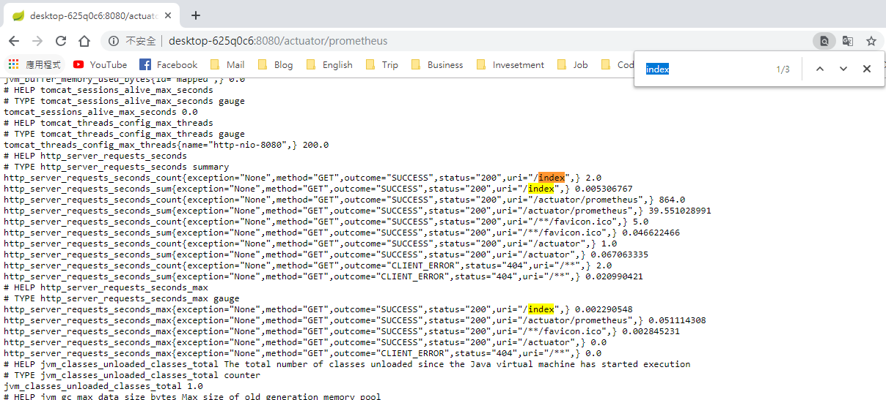

* 這次可以看到請求花費總時間(`http_server_requests_seconds_sum`)為 0.005306 秒，總次數(`http_server_requests_seconds_count`)為 2.0 次，本次請求最大值(`http_server_requests_seconds_max`)為 0.002290 秒。總時間為兩次請求所花費時間總和(`0.003016219 + 0.002290 = 0.005306`)。
    ```
    ...
    http_server_requests_seconds_count{exception="None",method="GET",outcome="SUCCESS",status="200",uri="/index",} 2.0
    http_server_requests_seconds_sum{exception="None",method="GET",outcome="SUCCESS",status="200",uri="/index",} 0.005306767
    ...
    http_server_requests_seconds_max{exception="None",method="GET",outcome="SUCCESS",status="200",uri="/index",} 0.002290548
    ```
* 接下來測試錯誤狀況，拜訪 [http://localhost:8080/fail](http://localhost:8080/fail) 會得到下面的錯誤頁面：

    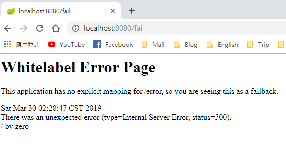

* 重新拜訪 spring-boot 在 Prometheus 上的端點 [http://localhost:8080/actuator/prometheus](http://localhost:8080/actuator/prometheus)，接著搜尋字串 `fail` 如下：

    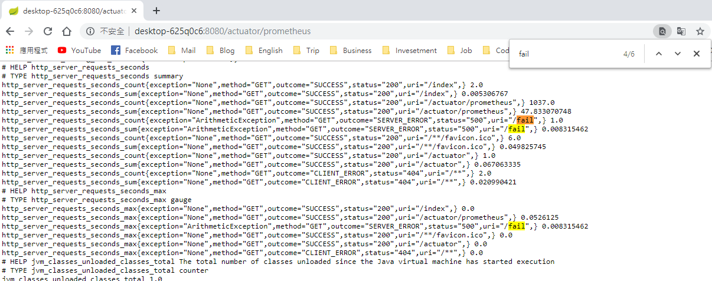

* 可以觀察到這次的狀態是 500，結果為 `SERVER_ERROR`，錯誤次數為 1.0 次。
    ```
    ...
    http_server_requests_seconds_count{exception="ArithmeticException",method="GET",outcome="SERVER_ERROR",status="500",uri="/fail",} 1.0
    http_server_requests_seconds_sum{exception="ArithmeticException",method="GET",outcome="SERVER_ERROR",status="500",uri="/fail",} 0.008315462
    ...
    http_server_requests_seconds_max{exception="ArithmeticException",method="GET",outcome="SERVER_ERROR",status="500",uri="/fail",} 0.008315462
    ```
* 再次拜訪錯誤路徑後，重新整理頁面，結果如下：
    
    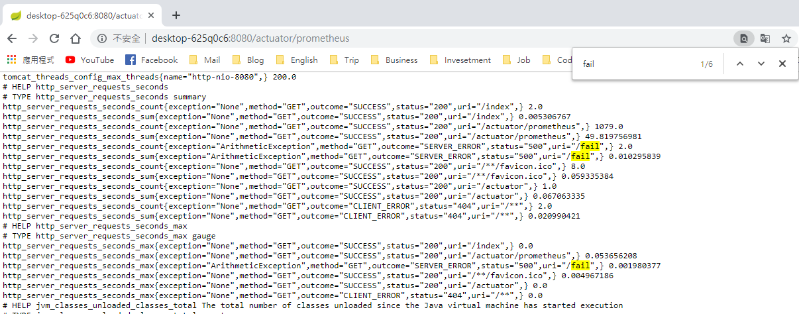
